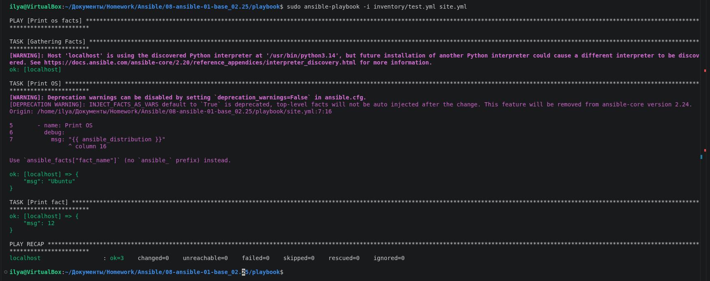
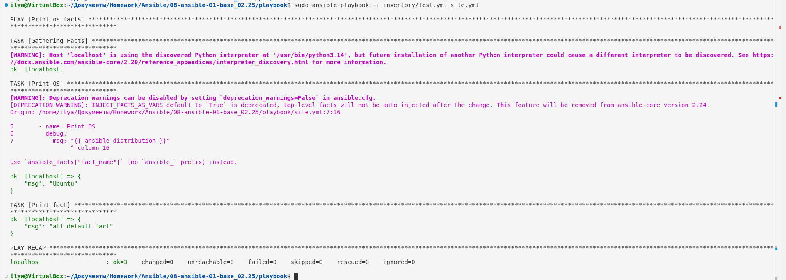
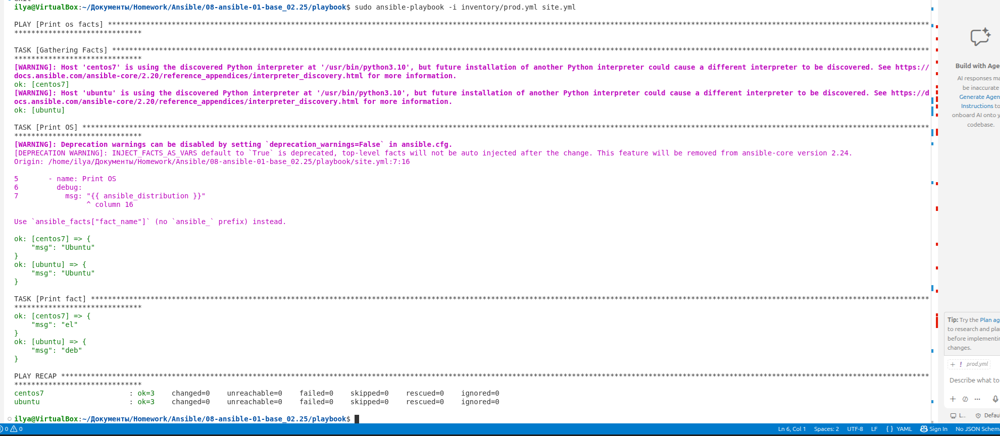
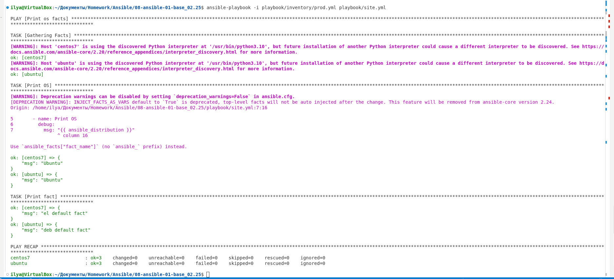
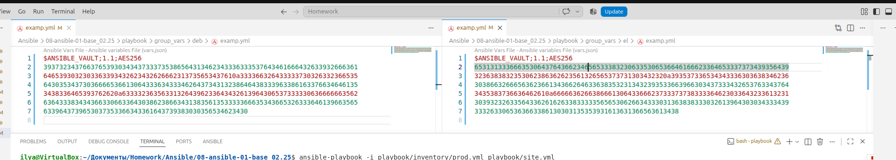
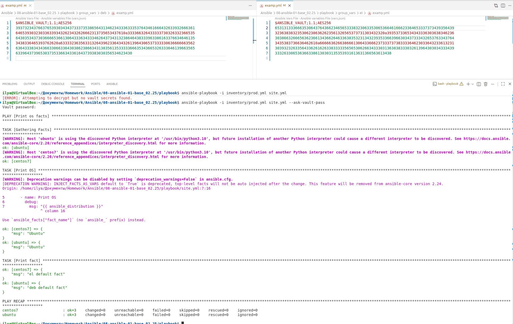
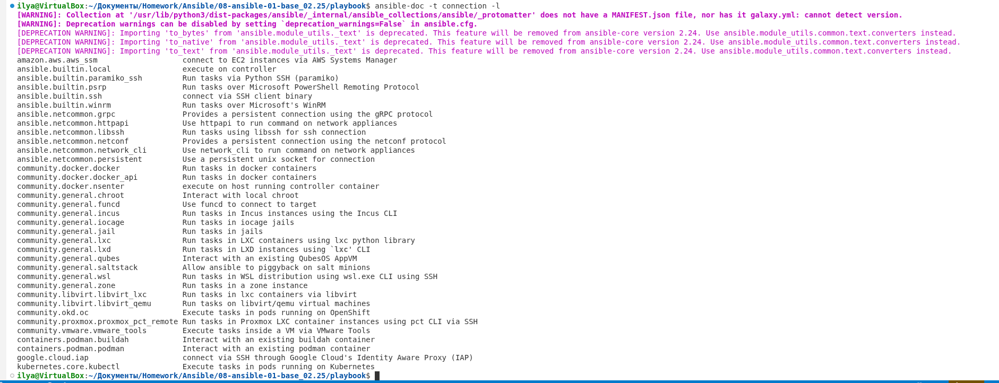
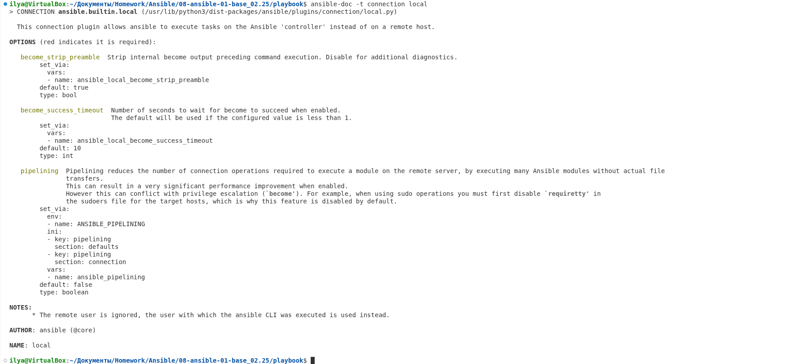
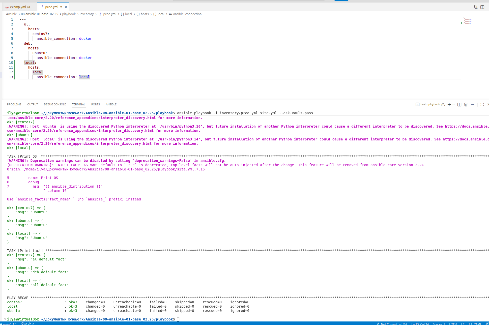

# Домашнее задание «Ansible»

| | |
|---|---|
| **Студент** | Демин Илья Викторович |
| **GitHub репозиторий** | https://github.com/deminilyadev-maker/Ansible.git |

---

# Оглавление

- [Задание 1](#задание-1)
- [Задание 2](#задание-2)
- [Задание 3](#задание-3)
- [Задание 4](#задание-4)
- [Задание 5](#задание-5)
- [Задание 6](#задание-6)
- [Задание 7](#задание-7)
- [Задание 8](#задание-8)
- [Задание 9](#задание-9)
- [Задание 10](#задание-10)
- [Задание 11](#задание-11)
- [Задание 12](#задание-12)
- [Задание 13](#задание-13)

---

# Задание 1

## Запуск playbook на окружении `test.yml`

Для выполнения задания был запущен playbook на тестовом окружении:

```bash
ansible-playbook -i inventory/test.yml site.yml
```

В результате было проверено значение факта `some_fact` для указанного хоста.

### Скриншот



---

# Задание 2

## Изменение значения `some_fact`

В каталоге `group_vars` был найден файл с переменными, в котором задавалось значение `some_fact`.

Значение было изменено на:

```yaml
some_fact: all default fact
```

После изменения был повторно запущен playbook для проверки результата.

### Скриншот



---

# Задание 3

## Подготовка окружения для дальнейших испытаний

Для дальнейших испытаний использовалось подготовленное Docker-окружение.

В качестве тестовых контейнеров использовались:

- `centos7`;
- `ubuntu`.

### Скриншот



---

# Задание 4

## Запуск playbook на окружении `prod.yml`

Playbook был запущен на production-окружении:

```bash
ansible-playbook -i inventory/prod.yml site.yml
```

В ходе выполнения были получены значения `some_fact` для каждого хоста из группы `managed`.

---

# Задание 5

## Настройка переменных `group_vars`

Для групп хостов были заданы соответствующие значения `some_fact`.

Для группы `deb`:

```yaml
some_fact: deb default fact
```

Для группы `el`:

```yaml
some_fact: el default fact
```

После изменения переменных playbook был запущен повторно.

### Скриншот



---

# Задание 6

## Повторный запуск playbook

После изменения переменных был повторно выполнен:

```bash
ansible-playbook -i inventory/prod.yml site.yml
```

В результате значения `some_fact` соответствуют переменным, заданным для групп хостов.

---

# Задание 7

## Шифрование переменных с помощью `ansible-vault`

Файлы переменных:

```text
group_vars/deb
group_vars/el
```

были зашифрованы с помощью `ansible-vault`:

```bash
ansible-vault encrypt group_vars/deb
ansible-vault encrypt group_vars/el
```

Для шифрования использовался пароль:

```text
netology
```

### Скриншот



---

# Задание 8

## Запуск playbook с использованием Vault

После шифрования переменных playbook был запущен с запросом пароля:

```bash
ansible-playbook -i inventory/prod.yml site.yml --ask-vault-pass
```

Ansible запросил пароль от Vault, после чего получил доступ к зашифрованным переменным.

### Скриншот



---

# Задание 9

## Поиск connection plugins

Список доступных connection plugins был получен с помощью:

```bash
ansible-doc -t connection -l
```

Для выполнения задач непосредственно на control node подходит plugin:

```text
ansible.builtin.local
```

Он позволяет выполнять задачи локально на управляющем узле.

### Скриншот



### Дополнительная проверка

Была выполнена дополнительная проверка документации Ansible.

### Скриншот



---

# Задание 10

## Добавление группы `local`

В файл:

```text
inventory/prod.yml
```

была добавлена новая группа хостов:

```yaml
local:
  hosts:
    localhost:
      ansible_connection: local
```

Таким образом, `localhost` использует connection plugin:

```text
local
```

и команды выполняются непосредственно на control node.

---

# Задание 11

## Запуск playbook с группой `local`

Playbook был запущен на production-окружении:

```bash
ansible-playbook -i inventory/prod.yml site.yml --ask-vault-pass
```

При запуске Ansible запросил пароль Vault.

Для `localhost` подключение выполняется локально через:

```yaml
ansible_connection: local
```

Факт `some_fact` для каждого хоста определяется из соответствующих переменных `group_vars`.

### Скриншот



---

# Задание 12

## Оформление README и публикация проекта

Результаты выполнения заданий были оформлены в `README.md`.

Изменения были добавлены в Git:

```bash
git add .
```

Создан коммит:

```bash
git commit -m "Complete Ansible homework"
```

После этого изменения были отправлены в GitHub:

```bash
git push -u origin master
```

Репозиторий:

https://github.com/deminilyadev-maker/Ansible.git

---

# Задание 13

## Скриншоты результатов выполнения

Все скриншоты размещены в отдельной папке:

```text
screenshots/
```

Использованные скриншоты:

- `Task1_playbook_test_inventory_r.png`
- `Task2_playbook_test_fact_changed.png`
- `Task3_docker_prod.png`
- `Task5_fact_changes.png`
- `Task7_vault_encrypt.png`
- `Task8_run_with_vault.png`
- `Task9_get_docs.png`
- `Task9_part2.png`
- `Task11_added_local.png`

Скриншоты подключены к README через относительные пути:

```text
screenshots/имя-файла.png
```

---

# Итог

В ходе выполнения домашнего задания были изучены и применены:

- запуск Ansible playbook;
- работа с inventory;
- переменные `group_vars`;
- факты Ansible;
- Docker-окружение;
- `ansible-vault`;
- шифрование переменных;
- запуск playbook с Vault;
- connection plugins;
- подключение к control node через `local`;
- работа с Git;
- публикация проекта в GitHub.
